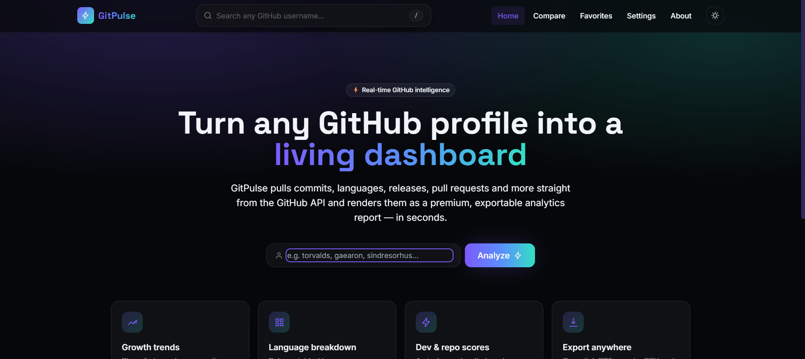

# GitPulse — Premium GitHub Analytics

GitPulse turns any GitHub username into a beautiful, interactive analytics dashboard:
commit activity, language breakdowns, growth trends, repository health scores, pull
requests, issues, releases, organizations, and more — all rendered client-side with
zero backend required.

Developed by **Yash Jain**.

## 🖥️ Preview

### Analytics


## ✨ Features

- GitHub username search with live autocomplete suggestions
- Full profile analytics: followers, following, repos, stars, forks
- Developer score (0–100) and per-repository health score
- Interactive charts: pie (languages), bar (top repos), line (growth), heatmap (activity)
- Pull request, issue, and release analytics per profile
- Organization support
- Repository filtering, sorting and "load more" pagination
- Side-by-side profile comparison
- Favorites and recently-viewed history (stored in `localStorage`)
- Export analytics as **PDF**, **CSV**, and **JSON**
- Copy/share profile links, toast notifications
- Dark/light mode with a single keypress (`d`) or the navbar toggle
- Keyboard shortcuts: `/` or `Cmd/Ctrl+K` focuses search
- Skeleton loading states, graceful empty states, and a custom 404 page
- Settings, About, Contact, Privacy Policy, and Terms & Conditions pages
- Client-side caching and graceful GitHub API rate-limit handling
- Fully responsive (mobile, tablet, desktop) and keyboard-accessible

## 🛠 Tech stack

- React 18 + Vite
- React Router v6
- Tailwind CSS (custom design tokens, glassmorphism, gradients)
- Recharts (pie / bar / line charts)
- jsPDF + jspdf-autotable (PDF export)
- Native GitHub REST API (no GraphQL, no backend)

## 🚀 Getting started

```bash
# 1. Install dependencies
npm install

# 2. (Optional) configure a GitHub token to raise the API rate limit
cp .env.example .env
# then edit .env and set VITE_GITHUB_TOKEN=ghp_xxx

# 3. Run the dev server
npm run dev

# 4. Build for production
npm run build
npm run preview
```

The app runs entirely in the browser. Without a token, GitHub allows 60 unauthenticated
API requests per hour per IP; with a personal access token (no scopes required for
public data) that rises to 5,000/hour. GitPulse caches every request for 5 minutes in
both memory and `localStorage` to minimize calls, and shows a clear message if the
rate limit is ever hit.

## 📁 Project structure

```
gitpulse/
├── public/                 static assets, SPA redirect rule
├── src/
│   ├── components/         Layout, shared UI primitives, charts
│   ├── lib/                GitHub API client, storage, context, exporters, data hook
│   ├── pages/               route-level pages (Home, Profile, Compare, Favorites, …)
│   ├── App.jsx              route definitions
│   ├── main.jsx              React entry point
│   └── index.css             Tailwind layers + design utilities
├── .env.example
├── index.html
├── package.json
├── tailwind.config.js
└── vite.config.js
```

## ⌨️ Keyboard shortcuts

| Key            | Action                  |
|----------------|--------------------------|
| `/` or ⌘/Ctrl+K | Focus the search bar    |
| `d`            | Toggle dark/light mode   |

## 🔒 Privacy

GitPulse has no backend and no analytics/tracking scripts. All requests go directly
from your browser to `api.github.com`. Search history, favorites, and preferences are
stored only in your browser's `localStorage`. See the in-app Privacy Policy for details.

## 📄 License

MIT — see [LICENSE](./LICENSE).

---

Developed by **Yash Jain**.
